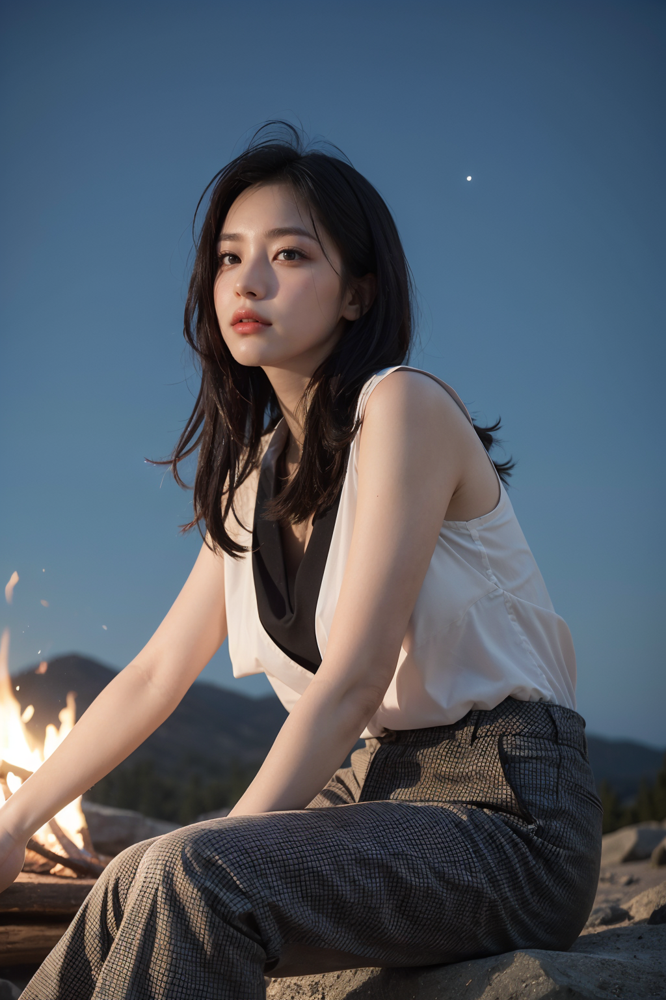
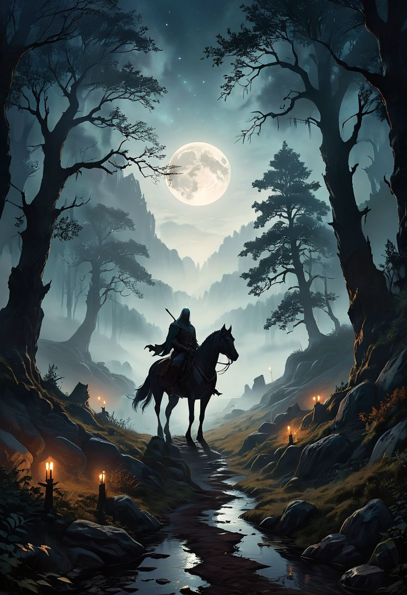

# prompts


```
(RAW, best quality:1.5, masterpiece:1.5), (realistic, photo realistic:1.3), ultra high res, UHD, high detail color photo, extremely detailed CG unity 8k wallpaper, absurdres, (realistic skin, transparent white glossy skin), (best shadow), (normal physical expression, perfect anatomy), (cinematic lighting), Moist eyes, Moist lips,
BREAK
1girl, solo, ((summer camp night)), low angle, (beautiful girl sitting on the ground), (sky full of stars), (campfire is burning), illuminating the surroundings with warm light, looking at viewer, (checkered pattern, hiking pants)
```


```
In the tranquil moonlit night, a lone Witcher rides through the ancient forests of the Continent. His silhouette is stark against the silver glow of the full moon, his form outlined by the ethereal light. The dense woods whisper ancient secrets as his horse treads through the mist-covered pathways. His eyes, keen and watchful, scan the shadows for any sign of danger. Behind him, the moon hangs low, casting its soft light over the medieval landscape, illuminating the towering trees and the winding path ahead. The air is thick with magic, and the night holds both mystery and danger in equal measure. vibrant, beautiful, translucent, intricate, detailed, many details, extreme detailed, full of details, Wide range of colors. Dramatic,Dynamic,Cinematic,Sharp details, Insane quality. Insane resolution. Insane details. Masterpiece. 32k resolution.
```