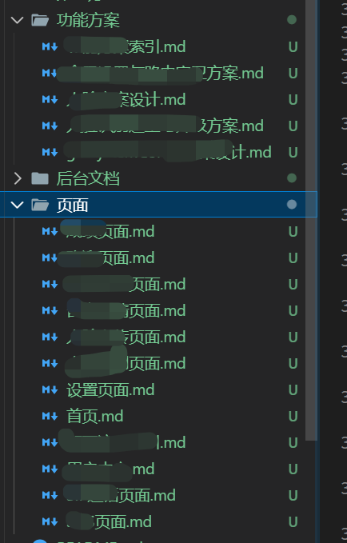

项目开发范式：
- AI 工具选型：Cursor / CodeX / Claude Code / OpenCode / ...
- AI 编程插件：OpenSpec
- 项目架构：通过 AI 调研 ｜ 参考开源项目
- 编写 /docs/ai/功能/xx.md 文档
- OpenSpec 读取文档，跑 task



下面给你一套**适合 Next.js 16 + OpenSpec** 的“先写 AI 编程文档 → /opsx:propose → 再拆 task”工作流目录结构，以及写这种文档的实用技巧。你可以直接照抄落地。

## 一、推荐目录结构（从“产品需求 → 设计 → 任务拆解”逐层收敛）

放在仓库里最常见、也最容易被工具读取的是：

```
/docs
  /ai
    README.md                # AI 协作总入口（如何用 /opsx:propose、约束、流程）
    /00-context
      glossary.md            # 术语表、缩写、约定
      decisions.md           # ADR/关键决策记录（为什么这么做）
      constraints.md         # 技术约束/非目标/边界
    /10-product
      prd.md                 # 需求说明（用户价值、范围、成功指标）
      user-stories.md        # 用户故事/用例
      acceptance.md          # 验收标准（可直接转测试用例）
    /20-design
      architecture.md        # 总体架构（模块、数据流、依赖）
      routes-and-pages.md    # Next 路由/页面结构（app router）
      data-model.md          # 数据结构/接口字段/状态机
      api-contracts.md       # API 契约（请求/响应/错误码）
      ui-spec.md             # UI 规格（组件、交互、loading/empty/error）
      security.md            # 鉴权、权限、敏感数据、审计
      observability.md       # 日志、埋点、监控、告警
      performance.md         # 性能预算/缓存策略/SSR-RSC边界
    /30-implementation
      coding-standards.md    # 代码风格、目录约定、命名
      scaffolding.md         # 脚手架/新模块怎么建
      test-plan.md           # 测试策略（单测/集成/e2e）
      rollout.md             # 灰度/发布/回滚方案
    /40-tasks
      propose-input.md       # 给 /opsx:propose 的输入总表（强约束+链接）
      task-breakdown.md      # 产出的任务清单沉淀（可选）
```

### 为什么这样分层

* **00-context**：把“全局约束与共同语言”提前定死，减少 AI 自己脑补。
* **10-product**：先对齐“做什么&怎么验收”，避免后面实现跑偏。
* **20-design**：对齐“怎么做”，特别是 Next 16 的路由、RSC/SSR 边界、数据流。
* **30-implementation**：把“怎么写代码”落到仓库规则，确保产出一致。
* **40-tasks**：把 “喂给 openspec 的入口文件”固定下来，便于一键 propose。

> 小建议：如果你们已有 `/docs` 或 `README` 体系，就把 `/docs/ai` 当成 AI 工作流专用区，不要把所有传统文档都塞进来。

---

## 二、给 OpenSpec 的“propose 输入文件”怎么写（关键）

在 `/docs/ai/40-tasks/propose-input.md` 里写成**强约束 + 明确输出格式**，并用链接引用前面的文档。

示例骨架：

* 目标：要做的功能一句话
* 范围：in / out
* 约束：Next16、现有目录、禁止改哪些、必须用哪些库
* 依赖：API、后端、环境变量
* 验收：可执行的 checklist
* 产出要求：让 /opsx:propose 输出哪些任务字段（任务名、估时、依赖、风险、验收点、涉及文件）

这样 OpenSpec 更容易稳定地产生你想要的 task 格式。

---

## 三、AI 编程文档的写作技巧（让 AI “不乱发挥、能直接落地”）

### 1) 写“约束”，要像写编译器规则

不要写“尽量”“最好”。写成：

* 必须 / 禁止 / 只允许
* 文件路径级别的约束（比如只能改 `app/(dashboard)/...`）
* 技术选型锁死（比如 `react-hook-form + zod`，不允许换）

**例：**

* ✅ 必须使用 Next.js App Router，页面放在 `app/` 下
* ✅ Server Actions 仅用于 X 类操作
* ❌ 禁止引入新的状态管理库（如 zustand/redux）

### 2) 写“验收标准”，要可测试、可截图、可断言

把验收写成 checklist 或 Given/When/Then。

* UI：空态/加载/错误态要明确
* API：错误码、失败提示、重试策略
* 权限：未登录/无权限怎么处理

### 3) 把“数据结构/契约”写成表格或 JSON 示例

AI 最怕模糊字段名。

* 请求/响应字段、类型、可空、默认值、错误码
* 最好提供 1-2 个完整样例

### 4) 明确 Next 16 的“边界点”

至少写清：

* 哪些组件是 Server Component / Client Component
* 哪些逻辑走 Server Actions / Route Handler
* 缓存策略：`fetch` cache、revalidate、tag
* SEO/metadata 需求（若有）

### 5) “非目标”写出来，能省一半返工

例如：

* 不做多语言
* 不做暗黑模式
* 不做导出
* 不做权限后台配置（先写死）

### 6) 任务拆解要“薄片化”，每个任务可独立 PR

让 AI propose 时按下面粒度切：

* 先脚手架与路由
* 再数据层/契约 mock
* 再页面与组件
* 再校验与错误处理
* 再测试与埋点
* 再发布/回滚

每个 task 都要包含：

* 修改文件列表（或目录范围）
* 验收点
* 风险/依赖

### 7) 给 AI 一个“仓库地图”

在 `coding-standards.md` 或 `scaffolding.md` 写：

* 目录规范（components、features、lib、types）
* 命名规范（kebab/camel/Pascal）
* 关键工具（eslint、prettier、test）
* 例子：新增一个 feature 的“标准落点”

### 8) 用 ADR/decisions 记录“为什么”

AI 经常会“重新发明轮子”。把关键决策（比如为什么不用某库、为什么用 RSC）写在 `decisions.md`，以后所有 propose 都引用它。

---

## 四、一个“最小可用版本（MVP）”目录（如果你想先少写点）

如果你现在只想快速起步，先建这 6 个文件就够：

```
/docs/ai/README.md
/docs/ai/00-context/constraints.md
/docs/ai/10-product/prd.md
/docs/ai/10-product/acceptance.md
/docs/ai/20-design/api-contracts.md
/docs/ai/40-tasks/propose-input.md
```

然后跑 `/opsx:propose`，等 task 出来再逐步补全设计文档。

---

如果你愿意，我可以按你们项目的实际情况（比如你们现在的 `app/` 结构、已有的 lint/test、是否用 tRPC/REST、是否有后端接口文档）给你生成一套**可直接提交到仓库的 docs/ai 初始模板**（含每个 md 的标题、段落、表格骨架、以及 propose-input 的固定输出格式）。你把你当前仓库的大致目录（贴个 tree 截图/文本）发我就行。
